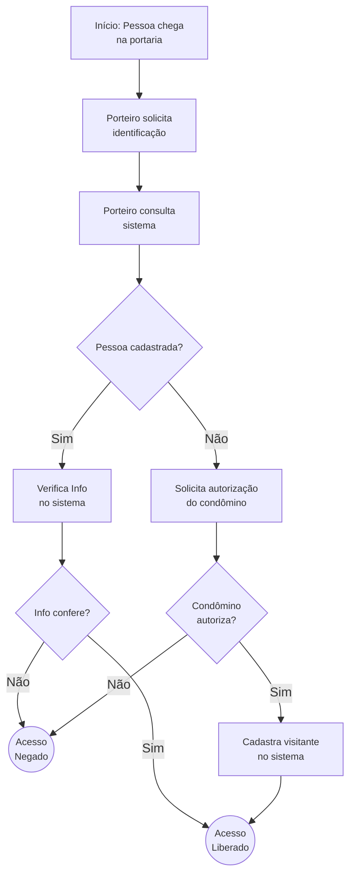

```mermaid
graph TD
    classDef s_font font-size:12px;

    A[Início: Pessoa chega<br>na portaria] --> B[Porteiro solicita<br>identificação];
    B --> C[Porteiro consulta<br>sistema];
    C --> D{Pessoa cadastrada?};

    D -- Sim --> E[Verifica Info<br>no sistema];
    E --> F{Info confere?};
    F -- Sim --> G((Acesso<br>Liberado));
    F -- Não --> H((Acesso<br>Negado));

    D -- Não --> J[Solicita autorização<br>do condômino];
    J --> K{Condômino<br>autoriza?};
    K -- Sim --> L[Cadastra visitante<br>no sistema];
    L --> G;
    K -- Não --> H;

    class A,B,C,D,E,F,G,H,J,K,L s_font;
```

