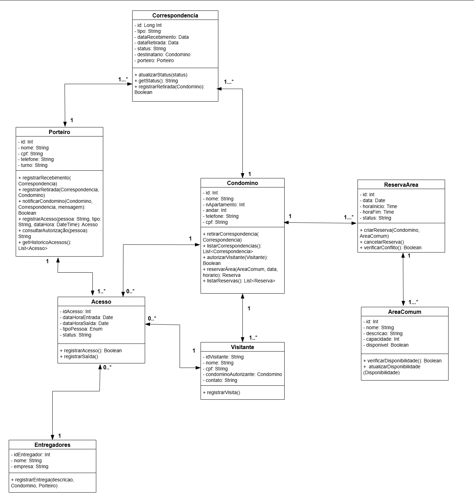
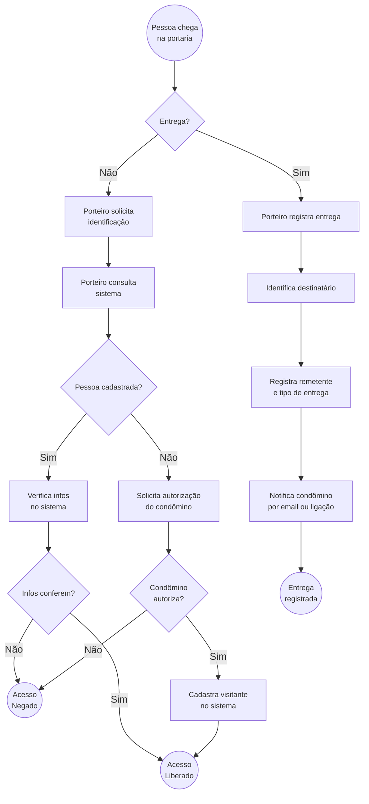
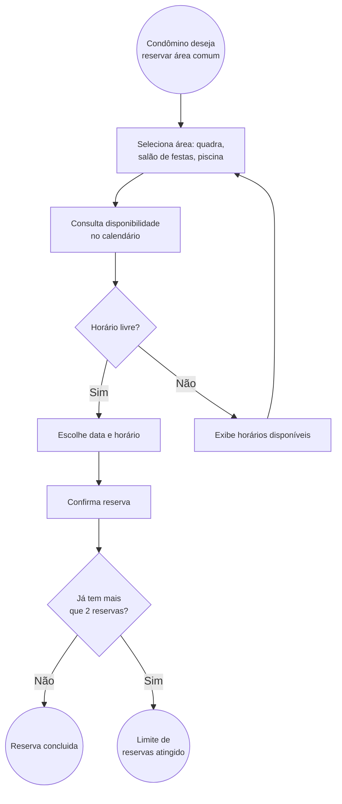
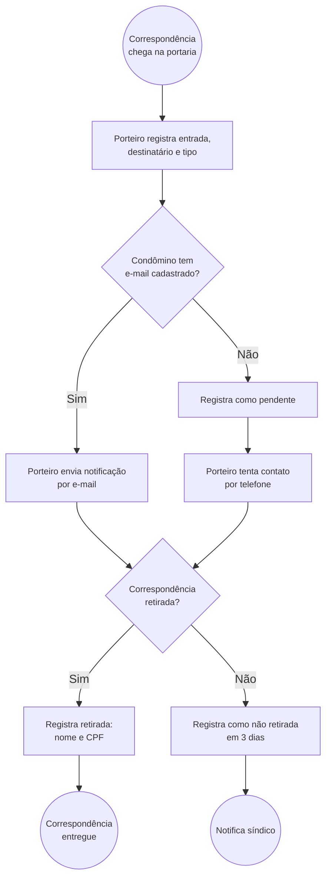

# 🏗️ Diagramas do Sistema de Gerenciamento de Condomínio
## 📘 Visão Geral
Este documento apresenta os diagramas estruturais e comportamentais desenvolvidos para representar o sistema de Gerenciamento de Condomínio, o qual contempla três principais histórias de usuário:

1. Controle de Correspondências

2. Reserva de Áreas Comuns

3. Controle de Entrada de Condôminos, Visitantes e Entregadores

O conjunto de diagramas foi elaborado com o objetivo de explicar a estrutura e o comportamento do sistema, de forma a oferecer uma visão clara para desenvolvedores e analistas sobre as funcionalidades implementadas.
Para o diagrama estrutural foi escolhido o diagrama de classes por ser o modelo mais adequado para representar a estrutura de dados e relacionamentos entre os componentes do sistema. E, no comportamental, o diagrama de atividades foi utilizado para demonstrar o fluxo de execução e tomada de decisão dentro de cada processo. Esse tipo de diagrama facilita a compreensão do comportamento dinâmico do sistema, especialmente no contexto de interação entre diferentes papéis (condômino, porteiro e síndico).

## 🧭 Padrões e Convenções Utilizadas

- Classes: representadas por retângulos com três divisões (nome, atributos e métodos).
- Associações: linhas entre classes com cardinalidades (1, 0..*, 1..*) indicando as multiplicidades.
- Decisões em atividades: losangos representando condições lógicas.
- Setas direcionais: indicam o sentido de navegação nas relações (quando aplicável).
## 🧩 Diagramas Estruturais
### 🔹 Diagrama de Classes

O diagrama de classes descreve a estrutura estática do sistema, representando as entidades principais, seus atributos, operações e relacionamentos.
Observando o diagrama proposto é possivel notar como os dados são organizados e como as classes se relacionam entre si para dar suporte às funcionalidades exigidas pelas histórias de usuário. 

    

Desse diagrama, nota-se que as principais classes são:
- Condômino – representa os moradores do condomínio, responsáveis por realizar reservas e autorizar visitantes.
- Porteiro – encarregado pelo registro de acessos e correspondências.
- Síndico – possui funções de gestão e supervisão, como aprovar reservas e emitir comunicados.
- Correspondência, Reserva, Acesso, Visitante, Entregador, ÁreaComum – classes de domínio que compõem as funcionalidades do sistema.

A figura mostra claramente as associações bidirecionais, multiplicidades e operações disponíveis, facilitando o entendimento da modelagem orientada a objetos.

## ⚙️ Diagramas Comportamentais
### 🔹 Diagramas de Atividade (Simplificados) do Sistema do Condomínio

#### 1. Controle de Entrada de Condôminos, Visitantes e Entregadores

- Descreve a sequência de ações do porteiro para verificar autorização, registrar entrada e armazenar histórico de acessos, como mostrado na figura a seguir.

#### 2. Reserva de Áreas Comuns

- Ilustra o processo de reserva realizado pelo condômino, a checagem de disponibilidade e a confirmação ou rejeição da reserva.

#### 3. Controle de Correspondências
- Mostra o fluxo desde o recebimento da entrega pelo porteiro até a notificação e retirada pelo condômino.
- Representa decisões condicionais (como a verificação do destinatário e atualização do status da correspondência).

## Conclusão
A partir dos diagramas estruturais e comportamentais desenvolvidos têm-se uma visão completa do sistema:
- O Diagrama de Classes demonstra a arquitetura e os relacionamentos entre as entidades.
- Os Diagramas de Atividades detalham o fluxo operacional das principais funcionalidades.
