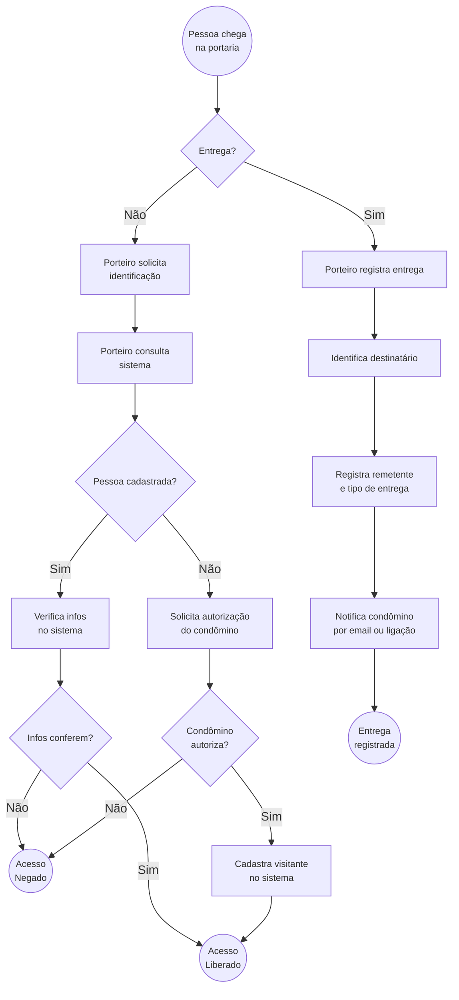
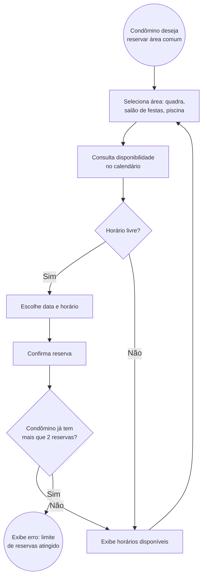
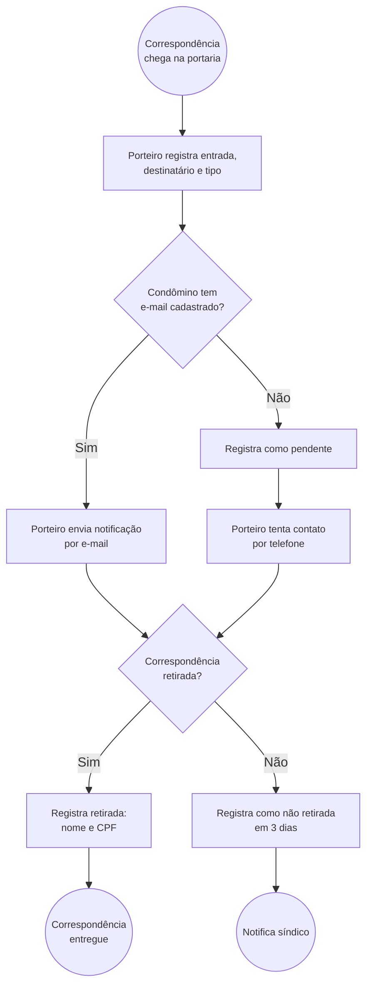

# Diagramas de Atividade (Simplificados) do Sistema do Condomínio

## 1. Controle de Entrada

```mermaid
graph TD
    classDef s_font font-size:12px;

    A((Pessoa chega<br>na portaria)) --> R{Entrega?};

    R -- Não --> B[Porteiro solicita<br>identificação];
    B --> C[Porteiro consulta<br>sistema];
    C --> D{Pessoa cadastrada?};
    D -- Sim --> E[Verifica infos<br>no sistema];
    E --> F{Infos conferem?};
    F -- Sim --> G((Acesso<br>Liberado));
    F -- Não --> H((Acesso<br>Negado));

    D -- Não --> J[Solicita autorização<br>do condômino];
    J --> K{Condômino<br>autoriza?};
    K -- Sim --> L[Cadastra visitante<br>no sistema];
    L --> G;
    K -- Não --> H;

    R -- Sim --> M[Porteiro registra entrega];
    M --> N[Identifica destinatário];
    N --> O[Registra remetente<br>e tipo de entrega];

    O --> P[Notifica condômino<br>por email ou ligação];
    P --> Q((Entrega<br>registrada));

    class A,B,C,D,E,F,G,H,J,K,L,M,N,O,P,Q,R s_font;
```

## 2. Reserva de Áreas Comuns

```mermaid
graph TD
    classDef s_font font-size:12px;

    A((Condômino deseja<br>reservar área comum)) --> B[Seleciona área: quadra,<br>salão de festas, piscina];
    B --> C[Consulta disponibilidade<br>no calendário];
    C --> D{Horário livre?};
    D -- Sim --> E[Escolhe data e horário];
    E --> F[Confirma reserva];
    F --> G{Condômino já tem <br> mais que 2 reservas?};
    G -- Não --> H((Reserva confirmada<br>no sistema));
    G -- Sim --> I((Exibe erro: limite<br>de reservas atingido));
    

    D -- Não --> H[Exibe horários disponíveis];
    H --> B;

    class A,B,C,D,E,F,G,H,I s_font;
```
## Controle de Correspondências

```mermaid
graph TD
    classDef s_font font-size:12px;

    A((Correspondência<br>chega na portaria)) --> B[Porteiro registra entrada,<br> destinatário e tipo];
    B --> D{Condômino tem<br>e-mail cadastrado?};
    D -- Sim --> E[Porteiro envia notificação<br>por e-mail];
    E --> I;

    D -- Não --> G[Registra como pendente];
    G --> H[Porteiro tenta contato<br>por telefone];
    H --> I{Correspondência<br>retirada?};
    I -- Sim --> J[Registra retirada:<br>nome e CPF];
    J --> K((Correspondência<br>entregue));
    I -- Não --> L[Registra como não retirada<br>em 3 dias];
    L --> M((Notifica síndico));

    class A,B,C,D,E,,G,H,I,J,K,L,M s_font;
```
