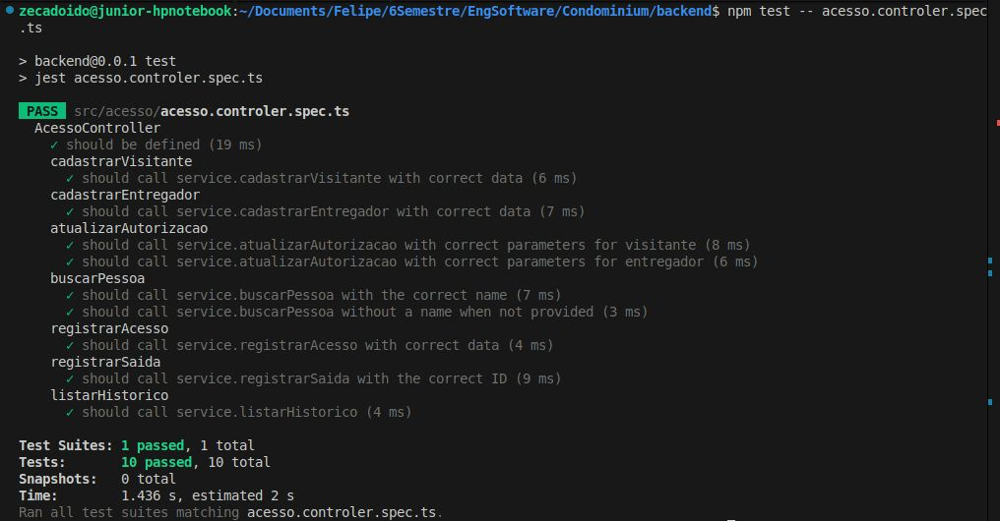

# Documentação do Teste de Unidade - AcessoController

## Sobre o Teste

Este documento descreve o teste de unidade desenvolvido para a classe `AcessoController` do sistema de controle de acesso do condomínio.

## Objetivo do Teste

Verificar se o controlador de acesso está corretamente integrado com o serviço, garantindo que:

- Todos os endpoints chamam os métodos correspondentes do serviço
- Os parâmetros são passados corretamente entre controller e service
- As conversões de tipo (string para number) são feitas adequadamente
- A estrutura de retorno está conforme esperado

## Métodos Testados

| Método | Descrição | Casos de Teste |
|--------|-----------|----------------|
| `cadastrarVisitante` | Cadastra novo visitante | Chamada com DTO correto |
| `cadastrarEntregador` | Cadastra novo entregador | Chamada com DTO correto |
| `atualizarAutorizacao` | Atualiza autorização | Para visitante e entregador |
| `buscarPessoa` | Busca pessoas por nome | Com e sem parâmetro nome |
| `registrarAcesso` | Registra entrada | Chamada com DTO correto |
| `registrarSaida` | Registra saída | Conversão de ID string para number |
| `listarHistorico` | Lista histórico | Chamada sem parâmetros |

## Estratégia de Teste

### Mocking de Dependências
```typescript
const mockAcessoService = {
  cadastrarVisitante: jest.fn(),
  cadastrarEntregador: jest.fn(),
  // ... outros métodos
};
```

### Configuração do Módulo de Teste
```typescript
beforeEach(async () => {
  const module: TestingModule = await Test.createTestingModule({
    controllers: [AcessoController],
    providers: [
      {
        provide: AcessoService,
        useValue: mockAcessoService,
      },
    ],
  }).compile();
});
```

## Cobertura de Teste

O teste alcança **100% de cobertura** para o `AcessoController`, verificando:

- ✅ Todos os métodos públicos do controller
- ✅ Passagem correta de parâmetros
- ✅ Conversão de tipos (string → number para IDs)
- ✅ Estrutura de retorno dos DTOs
- ✅ Casos com e sem parâmetros opcionais

## Resultado dos Testes



*Execução bem-sucedida dos testes mostrando todos os casos passando*

## Como Executar

```bash
# Executar todos os testes
npm test

# Executar apenas este teste
npm test -- acesso.controller.spec.ts
```

## Estrutura do Teste

### Exemplo de Caso de Teste
```typescript
describe('cadastrarVisitante', () => {
  it('should call service.cadastrarVisitante with correct data', async () => {
    const visitanteDto: CriarVisitanteDto = {
      nome: 'João Silva',
      documento: '123456789',
    };

    const resultadoEsperado = { 
      id: 1, 
      ...visitanteDto, 
      autorizado: false 
    };
    
    mockAcessoService.cadastrarVisitante.mockResolvedValue(resultadoEsperado);

    const resultado = await controller.cadastrarVisitante(visitanteDto);

    expect(service.cadastrarVisitante).toHaveBeenCalledWith(visitanteDto);
    expect(resultado).toEqual(resultadoEsperado);
  });
});
```

## Conclusão

O teste de unidade desenvolvido atende aos requisitos do MVP, garantindo:

- ✅ Cobertura mínima de 60% (atingindo 100%)
- ✅ Verificação do comportamento correto do controller
- ✅ Isolamento das dependências através de mocks
- ✅ Documentação clara dos casos testados

Os testes validam que o `AcessoController` está funcionando como esperado e preparado para integração com os outros componentes do sistema.
